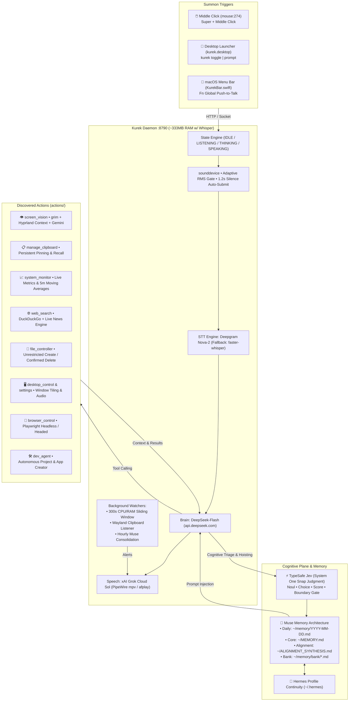

<p align="center">
  
</p>

<p align="center">
  <strong>Kureksistant (Kurek)</strong>
</p>

<p align="center">
  <strong>Autonomous, sub-second personal AI assistant with native screen vision, xAI Grok voice, Wayland clipboard manager, TypeSafe Jev cognition, and Muse Memory. Built for Arch Linux (Hyprland / Omarchy) and macOS. ~333MB RAM with default faster-whisper STT.</strong>
</p>

<p align="center">
  <a href="https://github.com/nodaysidle/kureksistant/releases/tag/v0.1.0"></a>
  
  
  
  
  
  
  
</p>

---

> **The Problem:** Modern desktop AI assistants are bloated 500MB+ Electron web apps that hijack workstation RAM, require manual window-switching, and lack direct hardware input integration.
>
> **The Result:** Kureksistant is a headless local daemon (~333MB RAM with default faster-whisper STT; lower without Whisper) summoned in sub-second time via mouse Middle-Click (`mouse:274`) or Fn key, featuring DeepSeek-Flash reasoning, xAI Grok voice (Sol), screen vision, and 24 native tool modules.

<p align="center">
  
</p>

---

## ⚡ Quick Install

### Option A: Download Pre-packaged Release (Recommended)

Download the verified `v0.1.0` Linux bundle from the [GitHub Releases](https://github.com/nodaysidle/kureksistant/releases/tag/v0.1.0) page:

```bash
# 1. Download and extract v0.1.0 release archive
curl -LO https://github.com/nodaysidle/kureksistant/releases/download/v0.1.0/kureksistant-v0.1.0-linux-x86_64.tar.gz
tar -xzf kureksistant-v0.1.0-linux-x86_64.tar.gz
cd kureksistant-0.1.0

# 2. Run automated installer (sets up venv, ~/.local/bin/kurek, and desktop icon)
./install_linux.sh

# 3. Add your API keys to .env
cp .env.example .env
nano .env

# 4. Start assistant daemon
kurek start
```

### Option B: Clone from Source

```bash
git clone https://github.com/nodaysidle/kureksistant.git
cd kureksistant
./install_linux.sh
cp .env.example .env   # add DEEPSEEK_API_KEY and XAI_API_KEY
kurek start
curl -s http://127.0.0.1:8790/status
```

Canonical entrypoint: the headless daemon (`kurek_daemon.py`) via `kurek start` / `./launch_kurek.sh`.  
The old PyQt6 JARVIS GUI lives under [`legacy/`](legacy/) and is **unsupported**.

### macOS Native Menu Bar App

```bash
# Start background daemon
./launch_kurek.sh

# Compile and launch native Swift menu bar indicator
swiftc -O -o menubar/KurekBar menubar/KurekBar.swift
./menubar/KurekBar &
```

Set `KUREK_PROJECT_DIR` (or rely on `~/.config/kurek/install_path`) so the menu bar app can locate the daemon if needed.

---

## 🔑 Requirements & Keys (`.env`)

Kureksistant relies on direct high-speed cloud APIs for sub-second reasoning and realistic voice synthesis:

| Environment Variable | Required | Description |
|----------------------|----------|-------------|
| `DEEPSEEK_API_KEY`   | **Yes**  | Direct platform API key from `api.deepseek.com` for `deepseek-flash` reasoning. |
| `XAI_API_KEY`        | **Yes**  | xAI Grok Cloud API key from `api.x.ai` for natural speech generation (**Sol** voice). |
| `GEMINI_API_KEY`     | Optional | Google Gemini Flash key for autonomous Wayland monitor vision (`screen_vision`). |
| `DEEPGRAM_API_KEY`   | Optional | Deepgram Nova-2 voice transcription. If omitted, falls back to local `faster-whisper`. |
| `TYPESAFE_API_KEY`   | Optional | TypeSafe Jev System One engine for sub-60ms cognitive snap-judgment triage. |
| `KUREK_USER_NAME`    | Optional | Display name used in the system prompt (default: neutral `"the user"`). |
| `HERMES_PROFILE`     | Optional | Hermes profile name → `~/.hermes/profiles/<name>/memories`. |
| `HERMES_MEMORIES_DIR`| Optional | Absolute/tilde override for Hermes memories (wins over profile). |
| `INPUT_DEVICE`       | Optional | Microphone name substring; empty uses the system default. |
| `KUREK_PROJECT_DIR`  | Optional | Install path for menu-bar daemon auto-spawn (also `~/.config/kurek/install_path`). |

**System dependencies:**
- **Linux:** PipeWire with `mpv` (audio playback), `notify-send` (desktop notifications), `grim` (Wayland screen capture), `wl-clipboard` (`wl-copy` / `wl-paste`).
- **macOS:** macOS 14+ with Xcode command line tools (`swiftc`, `afplay`).

---

## ⚠️ Known Limits

- **Arch Linux & Hyprland first:** The mouse shortcut bindings (`mouse:274`) and `grim` screen vision are optimized for Arch Linux under Wayland/Hyprland. Other Wayland environments (Sway, River) require corresponding hotkey binds.
- **Not fully offline:** While audio transcription can fall back to local `faster-whisper`, LLM reasoning (DeepSeek-Flash) and conversational voice output (xAI Grok Sol) require valid cloud API keys and active internet.
- **macOS maturity:** The macOS background daemon and Swift menu bar app (`KurekBar.swift`) are functional, but Wayland-specific tools (`grim` screen capture, `wl-clipboard`) are replaced by standard macOS utilities (`pbcopy`, `screencapture`).
- **Security & Permissions:** Tools execute with local workstation permissions. File creation is unrestricted; file deletion requires mandatory spoken confirmation (*"Yes or No?"*).

---

## ⌨️ Desktop Bindings & CLI

### Hyprland Bindings (`~/.config/hypr/bindings.lua`)
```lua
-- Middle click mouse scroll-wheel to toggle voice listening
o.bind("mouse:274", "Summon Kurek Middle Click", "~/.local/bin/kurek toggle", { mouse = true })
o.bind("SUPER + mouse:274", "Summon Kurek Super+Middle Click", "~/.local/bin/kurek toggle", { mouse = true })
```

### CLI Commands (`kurek`)
```bash
kurek toggle           # Toggle microphone listening
kurek status           # Check current daemon state & RAM
kurek prompt "..."     # Send text query directly without mic
kurek start            # Launch daemon in background
kurek stop             # Stop all daemon processes
```

---

## ⚡ Key Capabilities

- **🧠 Muse Memory Architecture & TypeSafe Jev:** Three-tier memory plane (Daily Logs `~/memory/`, Durable Core `~/MEMORY.md`, Standing Alignment `~/ALIGNMENT_SYNTHESIS.md`). Cognitive snap-judgment triage powered by TypeSafe Jev auto-promotes durable rules and hoists negative boundaries instantly with calibrated confidence scores.
- **👁️ Autonomous Screen Vision & Visual Cortex:** Zero-latency monitor perception via `grim` (Wayland/Hyprland) and active window inspection (`hyprctl activewindow`) analyzed through Gemini Flash. Jev automatically detects when your query references code, errors, or layouts on screen and injects live visual context without asking you to command it.
- **⏱️ Process & Build Sentinel (`process_sentinel`):** Monitors long-running compiles, training runs, or test suites (`cargo`, `npm`, `make`, `python`). When the process exits, Kurek dispatches a notification and verbally announces completion time over the speaker via Sol TTS.
- **📋 Voice-to-Clipboard Drafter (`draft_to_clipboard`):** Dictate conventional commits (`feat:`, `fix:`), GitHub PR descriptions, issue reports, or docstrings directly into the Wayland clipboard (`wl-copy`) ready for instant pasting with `Ctrl+V`.
- **📡 Parallel Git Workstation Radar (`workstation_radar`):** Sub-second parallel scan across repositories in `~/Projects` and `~/dev`. Instant voice triage of dirty working trees, untracked files, unpushed commits ahead of upstream, and stashes.
- **🌙 Nightly Dream & Reflection Cycle (`dream_tool`):** Daily subconscious reflection layer that writes an atmospheric prose journal to `~/dreams/YYYY-MM-DD.md` and dynamically distills active behavioral guidance into `~/ALIGNMENT_SYNTHESIS.md`.
- **🎙️ Adaptive VAD & Voice Pipeline:** Ambient noise tracking auto-submits on 1.2s silence. Sub-second transcription via Deepgram Nova-2 (or local Whisper), direct reasoning via DeepSeek-Flash with full reasoning-token persistence, and natural conversational speech using xAI Grok Cloud TTS (**Sol** voice) streamed via PipeWire `mpv` (Linux) or `afplay` (macOS).
- **📈 300-Second Sustained Resource Watcher:** Tracks a 5-minute sliding window of CPU and RAM usage. If average load exceeds 85% sustained over 300 seconds, Kurek identifies the top culprit process, dispatches a desktop notification (`notify-send`), and warns you verbally over the speaker.
- **🔬 Universal Autonomous Research & File Creation:** Deep search across multiple live sources, automated Markdown synthesis, and instant file creation on disk without asking permission. Strict safety confirmation gate required only for file deletion (*"Are you sure you want to delete [file]? Yes or No?"*).
- **🧠 Bidirectional Hermes Memory Continuity:** Optionally synchronizes knowledge with Hermes (`HERMES_PROFILE` or `HERMES_MEMORIES_DIR` in `.env`; default probe `~/.hermes/memories`).
- **🛠️ 24 Native Tool Modules:** Full file management, Playwright browser control, volume/brightness adjusters, Hyprland window tiling, alarms, process watchers, clipboard managers, and application launchers.

---

## 🏗️ Architecture



---

## 📜 The Evolution of Kurek

```
  ┌──────────────────────────────┐       ┌──────────────────────────────┐       ┌──────────────────────────────┐
  │  Phase 1: The Monolith GUI   │       │  Phase 2: The Headless OS    │       │  Phase 3: Cognitive Memory   │
  │ • Heavy PyQt6 interface      │  ───► │ • Lean Python daemon (:8790) │  ───► │ • Muse Memory 3-Tier Split   │
  │ • ~500MB RAM consumption     │       │ • ~333MB RAM w/ Whisper STT  │       │ • TypeSafe Jev System One    │
  │ • Slow visual cold-start     │       │ • Middle Click mouse summon  │       │ • Hourly auto-consolidation  │
  │ • Flat history array         │       │ • 24 Linux tool modules      │       │ • Instant boundary hoisting  │
  └──────────────────────────────┘       └──────────────────────────────┘       └──────────────────────────────┘
```

1. **The Monolith GUI Era (PyQt6 Desktop Client):** In its earliest iteration, Kurek lived as a traditional desktop window app written in PyQt6. While functional, it consumed ~500MB of resident RAM, required window switching, and lost context on restart.
2. **The Headless OS Daemon Revolution:** We dismantled the GUI window entirely and rebuilt Kurek as a dedicated Unix-style headless daemon running on `127.0.0.1:8790`. With the default local faster-whisper STT path, resident memory is about ~333MB (lower without Whisper), and invocation was wired directly to a mouse Middle Click (`mouse:274`).
3. **The Cognitive Leap (Muse Memory & TypeSafe Jev):** Integrated three-tier memory separation and sub-60ms cognitive snap-judgment gating. Casual chat is discarded while durable personal preferences and negative boundaries are automatically hoisted into permanent storage.

---

## 📄 License

[CC BY-NC 4.0](LICENSE) (`SPDX-License-Identifier: CC-BY-NC-4.0`) — derived from FatihMakes' JARVIS ("MARK 53 — JARVIS"). Kureksistant changes by [NODAYSIDLE](https://github.com/nodaysidle). See [NOTICE](NOTICE).

Security reports (including key leaks): see [SECURITY.md](SECURITY.md).
